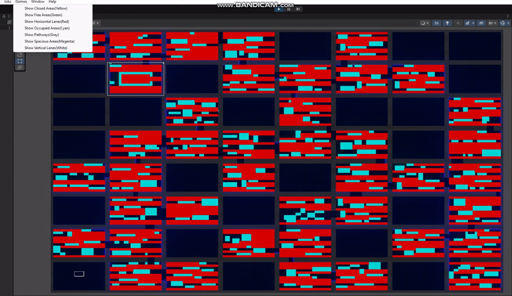
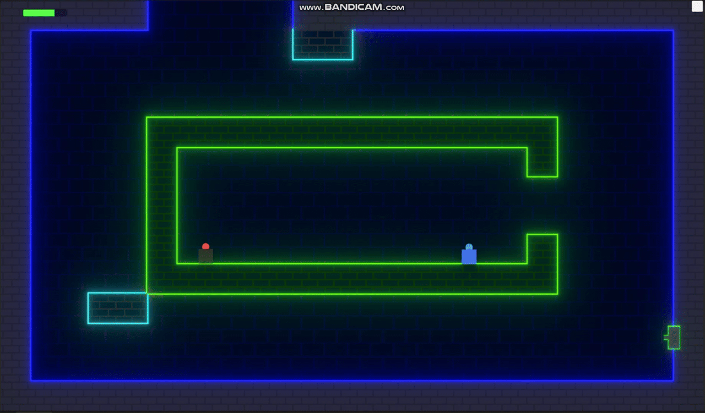
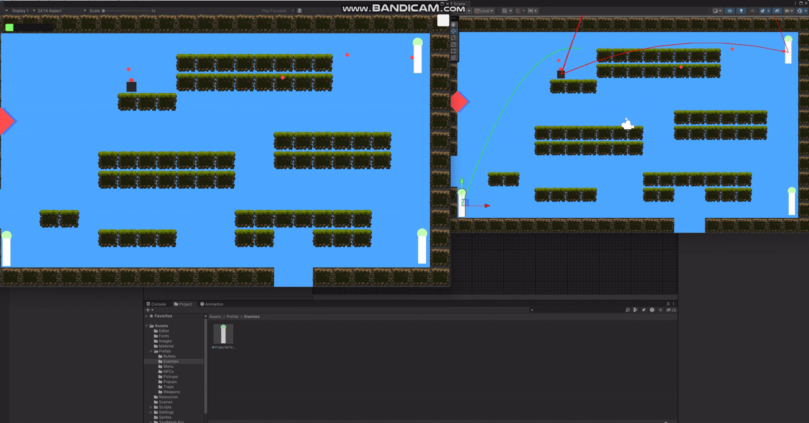

# 🧩 Procedural Dungeon Crawler

A procedurally generated 2D dungeon crawler built in Unity, designed for dynamic encounters, intelligent level design, and reactive enemies. Every run generates a brand new maze-like world — shaped by algorithms, analyzed for layout intent, and populated with traps, enemies, and events suited to the space.

> ⚠️ **Work in Progress:** This game is currently in development. New features, visuals, and polish are still being added.  
>
> 🎨 This is a solo project — all design, programming, and visual effects were done without an artist. The game's appearance is driven entirely by custom shaders, code-based visuals, and gameplay-driven ideas.

---

## 🧠 Core Systems & Highlights

- 🧱 **Procedural Level Generation**
  - Uses **Randomized Prim’s Algorithm** to generate maze layouts.
  - Applies **BFS traversal** to extract the longest valid path and dynamically place player start and end points.

- 🔍 **Room Analysis Engine**
  - Automatically detects layout types: horizontal lanes, vertical corridors, open rooms, and enclosed areas.
  - Enables contextual placement of traps and enemies based on spatial analysis.

- 👾 **Adaptive Encounter System**
  - Dynamically spawns enemies based on room classification.
  - Supports a growing library of enemy types:
    - Open-space attackers
    - Trap guardians
    - Predictive shooters

- 🎯 **Enemy AI with Predictive Logic**
  - Enemies calculate aim based on player velocity and direction.
  - Each enemy behavior is modular and easily extendable.

- 🧗‍♂️ **Player Mobility Mechanics**
  - Multi-jump support
  - Wall grabbing
  - Abilities unlocked dynamically mid-run

- 🛒 **Shop & NPC System**
  - NPCs provide dialogue and non-combat interactions.
  - Shops allow the player to purchase abilities, upgrades, or health using in-game currency.

- ⚙️ **Performance & Architecture**
  - Data-driven systems minimize memory usage and simplify procedural tuning.
  - Clean, **event-driven architecture** ensures decoupled systems and easy scaling.

---

## 🎬 Gameplay Showcase

### 🧠 Room Analysis & Contextual Spawning

  

Room layouts are automatically detected and classified to enable intelligent enemy and trap placement suited to the space.

---

### 🛒 Shop & NPC Interactions

  

Players can interact with friendly NPCs or spend currency in shops to acquire new abilities and resources during a run.

---

### 🤖 Predictive Enemy AI

  

Enemies detect the player’s motion and calculate angles to fire projectiles with predictive logic, increasing challenge and depth.

---

## 🔧 Tech Stack

- Unity (2022.x)
- C#
- Custom-built procedural systems
- Event-driven architecture
- Modular AI behaviors
- Data-driven encounter design

---
